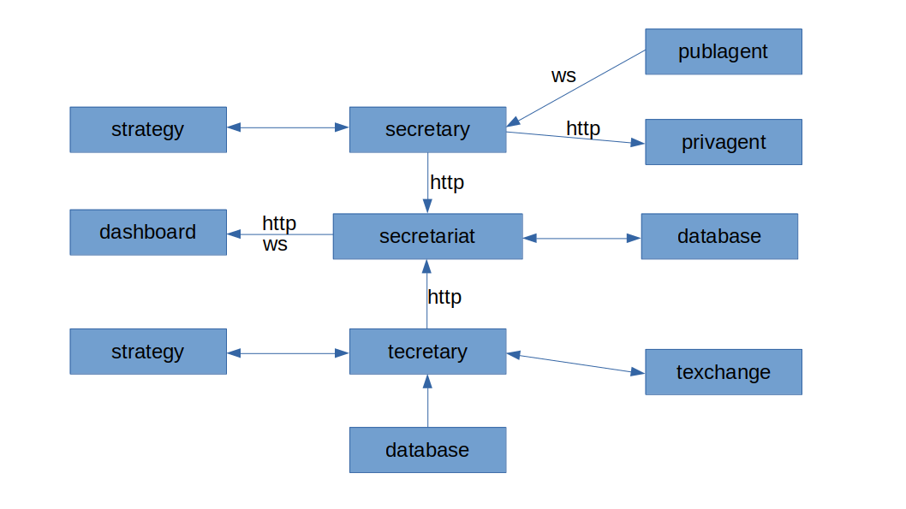

# bithub

## 架构

bithub 分为以下组件

- agent
    - publagent
    - privagent
- [secretary](https://github.com/bithub-framework/secretary)
- strategy
- [secretariat](https://github.com/bithub-framework/secretariat)
- [tecretary](https://github.com/bithub-framework/tecretary)
- [texchange](https://github.com/bithub-framework/texchange)
- dashboard

### publagent

每个交易所都有一个 publagent 程序，每个程序运行一个实例。用于获取该交易所中多个市场的行情数据，并转换为统一接口。

### privagent

每个交易所有一个 privagent 程序，每一个账户运行一个实例。用于发送交易指令，并提供统一接口。

之所以把 privagent 设计为 daemon 而不是 bindings，是为了让 privagent 可以跨语言开发。

### secretary

秘书程序以策略模式调用策略，向策略提供交互接口。

一个秘书可能连接多个市场。

秘书将交易状态信息主动提供给秘书处接。

### strategy

每一个策略都是一个不能独立运行的程序模块，以策略模式被秘书调用。

### tecretary

tecretary 是回测专用秘书，对策略暴露的接口与 secretary 完全相同。

tecretary 调用多个 texchange 作为模拟交易所。

### texchange

texchange 是一个模拟交易所，是 tecretary 的组件。

### secretariat

秘书处是一个单例 daemon，整合各个秘书的交易信息持久化并被动提供给仪表盘。

秘书开始运行时向秘书处注册自己。

### dashboard

仪表盘是一个 webapp，用于可视化实时运行状态和本地数据。

## secretary 连接到 agent

### 为什么不用消息队列代理 publagent

与「一对多发布订阅模型」相比，「多对多发布订阅模型」在语义上最大的区别在于，订阅者只关心事件，不关心发布者是谁，更不关心发布者的状态。

秘书作为订阅者很关心 publagent 的状态，其数学模型属于「一对多发布订阅模型」，只有直连发布者才符合其语义。而消息队列是对「多对多发布订阅模型」的实现，用消息队列会使语义与实现不一致，临床表现为如果 publagent 挂了秘书不知道。

### 服务发现

为了使 publagent 和 privagent 可插拔，本来应该整个 rpc 框架来实现 agent 的服务发现，但感觉杀鸡用牛刀。反正我也没打算让 agent 跨主机，所以就找个目录统一存放 socket 文件作为服务注册。

### 为什么秘书不用 websocket 连接 agent

websocket 的语义仅仅是「双向数据流」，要想实现「发布订阅模型」还得自己在 websocket 之上再实现一层。虽然也不是不行，但感觉像宰牛用剪刀。
